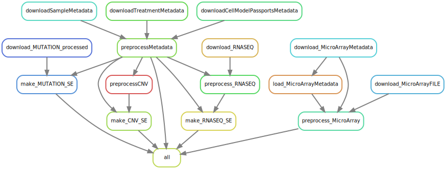

# This is a working repository for the GDSC Pipeline


# current pipeline status:
- no summarized experiments have been created yet.
  - rules and scripts have been created to outline the process but actual SummarizedExperiment objects have not been created yet.
- treatment data is yet to be downloaded.
  - idea is to build the MAE first as that is the same between GDSC1 and GDSC2
  - then build the GDSC1 and GDSC2 treatmentResponseExperiment in two new repos
- TODO:: annotate treatments and samples
- TODO:: annotate metadata for each `Experiment` object using config details
- TODO:: molecularProfiles Create SummarizedExperiments
  - rnaseq : DONE
  - cnv : 
    - Need to break up each assay into its own SummarizedExperiment
  - fusion : DONE
  - mutation : DONE
  - microarray : *need pre-processing*
 - SUMMARIZEDEXPERIMENTS NEED $annotation slot filled for PharmacoGx::summarizeMolecularProfiles
- TODO:: create conda environments + docker images for each rule and use them in the pipeline
  
# Molecular Profiles

- rnaseq 
- mutation
- cnv
- fusion 
- microarray (not yet implemented)

# SETUP AND EXECUTION

This pipeline has a snakemake profile set up at `workflow/profiles/`. 
This profile helps to remove the need to specify options at the command line.

### Installing snakemake 
For some reason, snakemake and python 3.12 has some f-string issues. 
``` bash
mamba create -n snakemake \
  -c conda-forge -c bioconda \
  snakemake=7.34 python=3.11 -y
```

To use this profile, set the environment variable:
``` bash
export SNAKEMAKE_PROFILE="workflow/profiles"
```
Now to run the pipeline, simply run:

``` bash
snakemake
```

# creating the workflow DAG

``` bash
snakemake \
  --snakefile workflow/Snakefile \
  --rulegraph | dot -Tsvg > resources/rulegraph.svg
```
### The following dag shows the pipeline steps, though the steps are not implemented for all. see TODOs above.


# Workflow Directory
The workflow directory is structured as follows:

``` bash
workflow/
├── config
│   └── config.yaml
├── envs
│   ├── cnv.yaml
│   ├── fusion.yaml
│   ├── microarray.yaml
│   ├── mutation.yaml
│   ├── PharmacoSet.yaml
│   ├── rnaseq.yaml
│   └── test.yaml
├── profiles
│   └── config.yaml
├── rules
│   ├── process_cnv.smk
│   ├── process_fusion.smk
│   ├── process_metadata.smk
│   ├── process_methylation.smk
│   ├── process_microarray.smk
│   ├── process_mutation.smk
│   └── process_rnaseq.smk
├── scripts
│   ├── cnv
│   │   ├── make_CNV_SE.R
│   │   └── preprocess_CNV.R
│   ├── fusion
│   │   ├── make_FUSION_SE.R
│   │   └── preprocess_FUSION.R
│   ├── metadata
│   │   └── preprocessMetadata.R
│   ├── methylation
│   │   └── preprocess_METHYLATION.R
│   ├── microarray
│   │   └── preprocess_MICROARRAY.R
│   ├── mutation
│   │   ├── make_MUTATION_SE.R
│   │   └── preprocess_MUTATION.R
│   ├── pharmacoset
│   │   ├── build_PharmacoSet.R
│   │   └── GDSC_PharmacoSet.Rmd
│   └── rnaseq
│       ├── make_RNASEQ_SE.R
│       └── preprocess_RNASEQ.R
└── Snakefile
```


# MultiAssayExperiment Subsetting
``` R
rowRanges(mae@ExperimentList[[1]]) -> mae_rows
mae[rowRanges(mae@ExperimentList[[1]]),] -> r
MultiAssayExperiment::subsetByRow(r, r_, maxgap = 2L, type = "within")

```


# READ IN ALL TRE
``` R

path <- "/home/bioinf/bhklab/jermiah/psets/PharmacoSet-Pipelines/GDSC/orcestradata/GDSC/results/data/treatmentResponse/"
files <- paste0(path,list.files(path))
files
tre_list <- lapply(files, qs::qread, nthreads =32)
tre_list

```