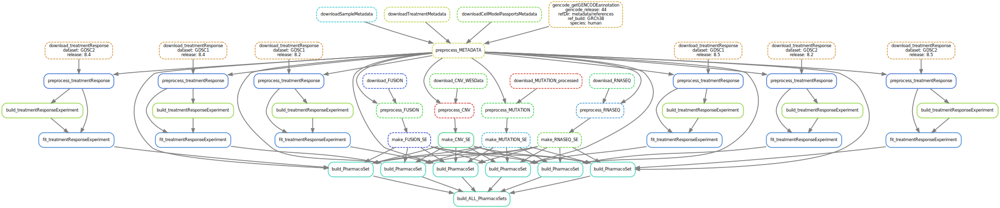

# This is a working repository for the GDSC Pipeline


# current pipeline status:
- no summarized experiments have been created yet.
- treatment data is yet to be downloaded.
  - idea is to build the MAE first as that is the same between GDSC1 and GDSC2
  - then build the GDSC1 and GDSC2 treatmentResponseExperiment in two new repos
  


# download source data files

``` bash
snakemake \
  --snakefile workflow/Snakefile \
  --cores 4 \
  --keep-going \
  downloadAllData
```